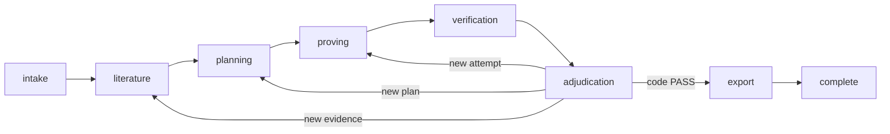

# QED

QED is a Codex-only mathematical research system for producing auditable proof
candidates. It freezes the problem and run policy, records literature evidence,
generates parallel candidates, sends each candidate to fresh verifier threads,
and exports a proof, verification report, and machine-readable manifest.

This fork is maintained by Junye Ji and preserves the
[upstream proofQED attribution](#upstream-attribution) and research archive.

SQLite owns every transition and event sequence. Model output cannot mark a run
complete. Application code computes PASS from immutable structured reports and
checks their candidate and verifier lineage before export.

## Trust model

QED creates a reproducible research record. It does not provide formal
verification, peer review, or a guarantee that a mathematical claim is true.
Researchers can inspect the evidence chain, proof bytes, proof-linked findings,
Codex thread provenance, code decision, and artifact hashes without trusting a
model's completion claim.

Structural and detailed verification run on fresh, read-only, offline Codex
threads. Citation verification also starts fresh and read-only; it may use the
restricted literature network policy. Every turn attempt receives a distinct
server-owned empty Git working directory. QED disables local shell, file,
browser, code-mode, plugin, and hook capabilities and never requests
full-access sandboxes or an approval bypass.

See [Architecture](docs/architecture.md) and the
[Threat model](docs/threat-model.md) for the full boundary map.

## Requirements

- [uv](https://docs.astral.sh/uv/) for Python, environments, dependencies, and
  package commands
- CPython 3.13 or 3.14; `.python-version` pins 3.14.6 for local work
- Node.js 22.12 or newer and npm for the React console
- an authenticated Codex session in QED's dedicated Codex state root for live
  research

QED uses no Conda environment. The lockfile pins the Python dependency graph,
including the official `openai-codex` SDK and its matching CLI package.

## Install

From a clean checkout:

```bash
uv sync --all-groups --frozen && npm ci
```

uv installs the pinned Python when the host does not have it and creates
`.venv`. Confirm the installed command and initialize the managed data root:

```bash
uv run qed --help
uv run qed init --data-root .qed
```

QED uses the pinned Codex binary from the uv environment and isolates it from
personal `~/.codex/config.toml` settings. Authenticate that binary once in the
dedicated state root before a live run:

```bash
mkdir -p .qed/codex-home
chmod 700 .qed/codex-home
QED_CODEX="$(uv run python -c \
  'from codex_cli_bin import bundled_codex_path; print(bundled_codex_path())')"
CODEX_HOME="$PWD/.qed/codex-home" "$QED_CODEX" login
```

QED does not copy or link personal `auth.json` credentials into this directory.
Managed launches also discard inherited `CODEX_ACCESS_TOKEN`, `CODEX_API_KEY`,
and `OPENAI_API_KEY` values, so authentication comes only from this dedicated
state root.
Treat the entire data root as sensitive: restrict access, never commit it, and
encrypt complete backups because `codex-home` may contain credentials and
session state. Credentials are not included in QED logs or exported proof
bundles.

## Run from the CLI

The live command uses the dedicated authentication context under the selected
data root and requires an exact model match in that account's model catalog:

```bash
uv run qed run \
  'Prove that the square of every odd integer is congruent to 1 modulo 8.' \
  --run-id odd-square-001 \
  --guidance 'Parameterize the odd integer.' \
  --verification-rule 'Check every divisibility claim.' \
  --data-root .qed
```

`qed run` waits for a terminal result. Open another terminal to inspect or stop
the run:

```bash
uv run qed status odd-square-001 --data-root .qed
uv run qed cancel odd-square-001 \
  --idempotency-key odd-square-cancel-1 \
  --data-root .qed
```

Resume a stopped, resumable run from its last durable stage boundary. Paused,
cancelled, and failed runs are resumable when no unconfirmed runtime turn or
live execution lease remains:

```bash
uv run qed resume odd-square-001 \
  --idempotency-key odd-square-resume-1 \
  --data-root .qed
```

A completed run writes:

```text
.qed/exports/<run-id>/<bundle-sha256>/
├── proof.md
├── report.md
└── manifest.json
```

The manifest binds hashes for the input, configuration, evidence, plans,
candidates, verifier reports, adjudications, code decisions, frozen turn
inputs, thread provenance, proof-linked findings, and exported proof and report.
It records the terminal `completed` run status and explicit code-derived `PASS`,
plus output-schema hashes, turn/backend lineage, prompt versions, canonical
runtime resolutions, execution segments, detailed usage and timing, and the
ordered event-chain hash. Usage separates input, output, cached-input, and
reasoning-output tokens, and records turn, search-query, and execution-time totals.

## Serve the API

Start the REST and SSE service on loopback:

```bash
uv run qed --log-level info --log-format json serve \
  --data-root .qed \
  --host 127.0.0.1 \
  --port 8000 \
  --runtime codex
```

Check the service:

```bash
curl --fail-with-body http://127.0.0.1:8000/api/v1/capabilities
```

Create a run with the complete typed configuration:

```bash
curl --fail-with-body \
  --header 'Content-Type: application/json' \
  --data @examples/run-request.json \
  http://127.0.0.1:8000/api/v1/runs

curl --fail-with-body \
  --header 'Content-Type: application/json' \
  --data '{"schema_version":1,"idempotency_key":"sample-start-1"}' \
  http://127.0.0.1:8000/api/v1/runs/sample-odd-square/commands/start
```

Follow ordered events:

```bash
curl --no-buffer \
  http://127.0.0.1:8000/api/v1/runs/sample-odd-square/events
```

SSE clients reconnect with `Last-Event-ID`. The service replays later stored
events before it follows new ones. See [Configuration](docs/configuration.md)
for the full run schema, bearer authentication, CORS, and remote-bind rules.

## Run the research console

Keep the loopback API running, then start Vite in another terminal:

```bash
npm run dev
```

Open <http://127.0.0.1:5173>. Vite proxies `/api` to the backend on port 8000.
The console lets researchers create a run, edit its guidance and verification
rules, inspect stages and events, compare sealed candidates, trace evidence and
findings, and issue cancel or resume commands.

The browser client does not accept, store, or send the QED API bearer token. A
remote browser deployment needs a same-origin backend-for-frontend (BFF) that
keeps the QED token server-side and gives the browser an HttpOnly, Secure,
SameSite session cookie. See [Operations](docs/operations.md) before serving the
console outside loopback.

## Research lifecycle



The frozen configuration caps run time, stage time, tokens, proof attempts,
plan revisions, strategy rewrites, search queries, active candidates, active
verifiers, and concurrent runs. It also controls whether QED may request
proactive Codex delegation. Failed or interrupted proof calls retain their
attempt reservations. QED records each turn attempt before the model call, so
restarting a process does not reset retry counts, other persisted counters, or
recorded usage.

Revision-stage gates use records from the current cycle. In particular, a
revised proving cycle needs newly sealed candidates and verification reports
for those candidates; records from an earlier cycle remain in the audit history
but cannot advance the run.

QED validates locally representable runtime controls, then durably records an
attempt before invoking the runtime. A normal stream end before any thread
starts closes that attempt as not started. Once remote
acceptance is possible, the execution owner keeps its lease until the exact turn
emits a confirmed terminal event. An unknown start result is recorded as
`runtime.turn_start_unconfirmed`; a known turn without a terminal is recorded as
`runtime.turn_terminal_unconfirmed`. QED keeps an in-process reconciliation pump
for late terminals and drains it before service shutdown. Until reconciliation,
it refuses cancellation acknowledgement, lease release, resume, or replacement
execution. This fail-closed state preserves
single-owner semantics and requires incident investigation if reconciliation is
no longer possible.

## Legacy archives

Import an old file-based run without executing or trusting it:

```bash
uv run qed migrate /absolute/path/to/legacy-run --data-root .qed
```

QED copies regular files into a content-addressed `legacy_untrusted` archive,
rejects symbolic links, and leaves the source unchanged. It does not promote an
old provider verdict into current state. Read [Migration](docs/migration.md)
before changing retention for historical runs.

## Development

Run the repository gates:

```bash
uv sync --all-groups --frozen
uv run ruff check .
uv run mypy src
uv run pytest
uv build
npm run lint
npm run typecheck
npm test
npm run test:impeccable
npm run build
npm run impeccable
npx playwright install chromium
npm run test:e2e
```

The default test suite uses mocked Codex adapters. Tests marked `real_codex`
remain opt-in and can consume credentials, network access, and model quota.

Contributor rules and the pull-request checklist live in
[CONTRIBUTING.md](CONTRIBUTING.md). Operational startup, backup, recovery, and
upgrade steps live in [Operations](docs/operations.md). Runtime research and
source records live under [`docs/research/`](docs/research/).

## Historical research record

This fork preserves the upstream [`prompts/`](prompts/), sample inputs, proved
statements, expert commentary, and original mathematical skill artifact at
[`skill/super_math_skill.md`](skill/super_math_skill.md).

| Archive | Preserved record |
| --- | --- |
| [`analysis-May-19-2026`](proved_statements/analysis-May-19-2026/) | Three advection-diffusion lower-bound results and the upstream expert assessment. |
| [`algebraicgeometry-May-17-2026`](proved_statements/algebraicgeometry-May-17-2026/) | The integral local invariant cycle theorem in degree one, its proof, references, and original expert source. |
| [`prob-May-15-2026`](proved_statements/prob-May-15-2026/) | Two lamplighter random-walk asymptotic results, proofs, and expert comments. |
| [`analysis-Apr-24-2026`](proved_statements/analysis-Apr-24-2026/) | Four submitted analysis problems, including rejected and human-reviewed records. |
| [`pde-Mar-23-2026`](proved_statements/pde-Mar-23-2026/) | The Carleman-weight result, workflow, and expert statement; its underlying proof remains unreleased. |

These archives are historical evidence. QED does not import an upstream verdict
as a current PASS.

The [legacy preservation map](docs/research/legacy-preservation-map.md) records
the retained assets and the removed provider runtime.

## Maintainer

This Codex-native fork is maintained by Junye Ji, <jijunye1@outlook.com>.

## Upstream attribution

QED originated with Chenyang An, Qihao Ye, Minghao Pan, and Jiayun Zhang:

- Chenyang An, <cya.portfolio@gmail.com>
- Qihao Ye, <q8ye@ucsd.edu>
- Minghao Pan, <mpan2@caltech.edu>
- Jiayun Zhang, <landiveo@gmail.com>

Paper: [QED: An Open-Source Multi-Agent System for Generating Mathematical
Proofs on Open Problems](https://arxiv.org/abs/2604.24021)

```bibtex
@misc{an2026qedopensourcemultiagentgenerating,
  title={QED: An Open-Source Multi-Agent System for Generating Mathematical Proofs on Open Problems},
  author={Chenyang An and Qihao Ye and Minghao Pan and Jiayun Zhang},
  year={2026},
  eprint={2604.24021},
  archivePrefix={arXiv},
  primaryClass={cs.AI},
  url={https://arxiv.org/abs/2604.24021}
}
```

The repository retains the upstream MIT license in [LICENSE](LICENSE).
