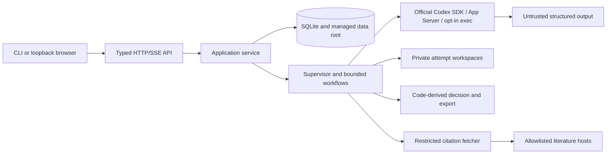

# QED v2 threat model

Review date: 2026-08-11. This document describes the current v2 stable-candidate
runtime. QED is Codex-only: a fresh thread isolates conversation state, but it
does not create independent model weights. QED policy PASS is a code-computed
release decision, not a claim of formal or mathematical truth.

## Assets and actors

Assets include dedicated Codex authentication state, frozen problems and rules,
SQLite state and WAL files, leases and fencing generations, immutable research
records, proof candidates and verifier reports, citation bytes, export bundles,
event-chain roots, runtime provenance, and operator evidence. Credentials,
tokens, cookies, and authorization headers must never enter logs or bundles.

Actors are the operator, an untrusted API/browser client, an untrusted Codex
output, a stale or compromised local worker, an untrusted literature response,
another local process, and a malicious or compromised dependency. The host
service account and the operator-controlled dedicated `CODEX_HOME` are trusted
within the stated deployment assumptions.

## Trust boundaries

The browser never receives a bearer credential and cannot read the data root.
The API accepts only strict typed commands. The read model cannot write durable
state. SQLite owns transitions, event sequence numbers, idempotency receipts,
attempt reservations, budgets, leases, and fencing. Runtime adapters cannot
decide policy or write export state. The offline bundle verifier imports no
runtime or network module.

## Abuse cases and mitigations

| Abuse case | Required control | Residual status |
| --- | --- | --- |
| Mock or non-Codex provider reaches production | CLI/API/service production construction accepts only official Codex runtime; fixture runtime is test-only and provenance is marked `fixture` | Regression tests exist; real canary remains unrun |
| Model, backend, executable, or version silently changes | Exact OpenAI provider, model, runtime, backend, effort, catalog, capability, executable, prompt, schema, and protocol hashes are immutable runtime-resolution fields; missing identity fails closed | The App Server catalog currently supplies the selected model identifier as `model_version`; an independently published model-build version remains a release limitation |
| Caller supplies observed runtime metadata | Service derives runtime version from the runtime adapter and rejects a caller override | Regression test required in final gate |
| Expired worker mutates lifecycle state | Every lifecycle write checks the active lease and fencing generation; stale owners are rejected | Crash/fault matrix still needs a complete release run |
| Symlink, junction, hard-link, traversal, or TOCTOU escapes a managed root | Managed roots and attempt/export paths reject links, require private modes, use descriptor/link checks where available, and verify directory identity before publication | Platform matrix and mount/junction tests remain required |
| Verifier changes the proof or uses network/tools | Verifier turns receive frozen read-only workspaces, no command network, no approval escape, and role-specific capability policy | Citation fetching is fail-closed until the restricted fetcher is the only active citation network path |
| Prompt injection changes policy or schema | Source trust is typed (`runtime_observed`, `model_reported`, `server_captured`, `benchmark_fixture`, `operator_supplied`); model text cannot write verdicts, schemas, sandbox, or network policy | New source types require review |
| SSRF, DNS rebinding, redirect-to-private, or decompression bomb | `RestrictedCitationFetcher` normalizes hostnames, validates resolved addresses before and after redirects, pins the connection address, limits redirects/time/bytes, rejects private/reserved/metadata addresses, checks MIME and magic bytes, and treats documents as inert bytes | Native citation web search is disabled until adapter integration is proven |
| Oversized or unknown runtime protocol event | Typed versioned adapters reject unknown critical events and cap JSONL frame size at 1 MiB; late/missing identities fail closed | Real SDK/App Server fixture drift canary is unrun |
| SSE client causes memory or state-machine blockage | Replay has a cap, stream lifetime and quotas are bounded, each subscriber has a bounded queue, and slow clients receive an explicit failure | Multi-process load evidence is pending |
| Export claims more than SQLite observed | Manifest records export intent separately from terminal state; bundle verifier checks event-chain range, publication phase, hashes, lineage, claim graph, and code-derived decision | Optional Ed25519 signing is not enabled; unsigned means integrity only |
| Credential or authorization leakage | Ambient Codex auth variables are scrubbed; personal `~/.codex` is rejected; private roots and structured deterministic redaction are required | Operator must protect the external credential directory and backups |
| Legacy or fixture content becomes current authority | Legacy and benchmark provenance remain explicit; only current structured records and application policy can produce PASS | Historical Markdown can still be misread by a human |

## Security invariants

- Production AI access is only the official OpenAI Codex SDK, version-matched App
  Server, or explicitly acknowledged official `codex exec`; no provider router,
  generic Responses API proof authority, or agent framework exists.
- Structural, detailed, assumptions/quantifiers, counterexample/edge-case, and
  reconstruction verifiers are offline. Citation is allowed only through the
  restricted fetcher once wired; otherwise it is disabled and cannot silently
  widen network access.
- A candidate needs N-of-N required verifier roles, independent fresh external
  thread identities, complete stable rule and claim coverage, no FAIL/UNCERTAIN,
  and confirmed runtime provenance. Application code computes the decision.
- Exports are content-addressed. SHA-256 is integrity addressing, not a
  signature, trusted timestamp, author identity, or source authenticity proof.
- Non-loopback deployment is unsupported and rejected until a same-origin BFF,
  HttpOnly/Secure/SameSite session boundary, CSRF and Origin checks, exact CORS
  allowlist, and TLS deployment contract are implemented.

## Explicit non-goals

QED does not provide formal verification, independent model weights, peer
review, a trusted timestamp, source authenticity merely from a hash, multi-user
authorization, public remote deployment, automatic execution of literature
documents, or automatic reconciliation when an external backend cannot answer
the exact thread/turn status query. An operator may abandon an unrecoverable run;
the store records that disposition and never invents a runtime terminal.

## Release evidence and residual blockers

The baseline Codex Security scan was `61393cb5-6ff6-4961-b53f-91e24926455a`
with partial coverage and eight source-backed findings (five medium, three
low). The v2 candidate tracks each finding with regression tests, but this
document does not convert a test result into a clean security rating. The
security dimension remains blocked until the final security gate, path/network
property tests, secret/export scan, migration preflight, and a release-window
Codex security review all pass. No Critical/High finding may remain, and every
Medium finding needs an owner and dated acceptance before release.

Review this model whenever a change adds a route, credential source, runtime
control, network host, sandbox capability, export artifact, schema migration,
or deployment topology. Historical alpha audit material is retained only as
historical research and is not a current runtime security boundary.

Repository: target_sha256_192a804361b55a71e1da32163a5310fcf01116f9c4b58827fb9f273253013066
Version: codex-security-snapshot/v1:sha256:bcece120c01f5cf5740d08cf93f1f8fb9acd9521933288a51794205f86610bf5
