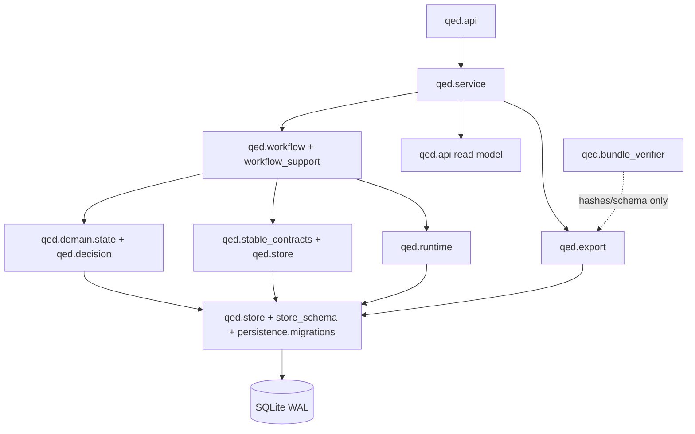

# QED v2 architecture

QED turns one frozen mathematical problem into a content-addressed research
record. SQLite is the only durable authority. Official OpenAI Codex threads
perform bounded work; application code computes QED policy decisions.

## Bounded contexts and dependency direction

The bounded-context names below are logical ownership boundaries. They are
mapped to the shipped modules in this repository; the implementation does not
create empty package facades merely to make the names look more granular.

The public `RunStore`, `ResearchWorkflow`, and API shapes remain compatible
with existing callers while their internal contracts have explicit owners:

| Logical context (shipped owner) | Owns | Must not own |
| --- | --- | --- |
| Domain state (`qed.domain.state`; `qed.state_machine` is a compatibility facade) | one `CommandSpec` transition table and terminal rules | SQL, Codex calls |
| Persistence (`qed.store`, `qed.store_schema`) | transactions, repositories, event sequence, receipts, snapshots, leases and fencing | model policy |
| Migrations (`qed.persistence.migrations`, CLI wiring in `qed.migration`) | preflight, staged upgrade, backup/restore | runtime execution |
| Research records (`qed.stable_contracts` plus store-owned immutable rows) | evidence, plans, candidates, proof spans, provenance and claim-graph records | network policy |
| Runtime attempts (`qed.runtime`) | turn reservation contract, lifecycle, reconciliation, usage and Codex adapters | export verdict |
| Verification policy (`qed.stable_contracts`, `qed.decision`) | required roles, rule/claim coverage and N-of-N inputs | free-text adjudication |
| Mathematical decision (`qed.decision`) | pure code-derived candidate decision | model-generated PASS |
| Export (`qed.export`, `qed.bundle_verifier`) | manifest, chain, hashes, signatures/status and offline verification | starting a runtime |
| API commands/read model (`qed.api`, called through `qed.service`) | write contracts and read projections | direct SQL mutation in views |
| Orchestration (`qed.workflow`, `qed.workflow_support`) | supervision, retry, cancel, resume and recovery | durable authority |
| Observability (`qed.logging` and store-owned events) | structured events and deterministic redaction | credentials |

There is deliberately no generic provider, no second model interface, and no
standalone `qed.*` module for every row in this table. The table is the
reviewable dependency contract; the named shipped owner is the authority.

## State and durable boundaries

The `CommandSpec` table is the authoritative transition matrix. Each command
declares source states, target state, transaction boundary, emitted event
families, retry behavior, stale-owner behavior, and crash-recovery behavior.
Store-assigned event sequences are contiguous and replayable. A write command
requires an idempotency key; a repeated key returns its durable receipt without
repeating the side effect.

Start/resume acquire a lease and fencing generation. Every lifecycle write,
including terminal and release events, checks the current owner and expiry.
Attempt reservations and budgets are durable before a runtime call, so process
restart cannot replenish attempts or token allowances. A resumed run appends a
new execution segment and never edits frozen input, candidates, or reports.
Cancellation records the request before interruption and cannot become terminal
until late runtime events are confirmed. An unconfirmed start or terminal keeps
the run fail-closed even after lease expiry; `qed reconcile` diagnoses the
limitation and `qed abandon` records an operator decision.

## Runtime contract

Production construction exposes only the official Codex SDK adapter, the
version-matched Codex App Server adapter, and an explicitly acknowledged
official `codex exec` adapter. A fixture runtime is test-only. No generic
provider interface or model router is exposed to product callers.

Each execution segment persists an immutable `RuntimeProvenance` containing the
exact OpenAI provider, model ID, model/runtime/CLI/SDK/App Server versions,
backend, requested and selected reasoning effort, catalog/config/prompt/schema/
executable/capability hashes, and protocol version. Missing identity,
unsupported effort, silent substitution, version mismatch, unknown critical
event, missing thread/turn identity, oversized frame, or late terminal is a
NON_PASS condition.

Roles differ only by prompt/schema, reasoning effort, fresh thread, and the
minimum frozen input required for the task. A fresh verifier thread isolates
conversation state; it does not produce independent model weights. Verifiers
receive private read-only workspaces and no command network. Citation network
access is disabled until the restricted fetcher is the only attested path.

SDK, App Server, and exec adapters share typed versioned lifecycle events and
the same conformance expectations for acceptance, cancellation, resume, usage,
schema failure, unknown/late terminal, and identity binding. App Server events
are routed by `(external_thread_id, turn_id)`, not broadcast.

## Mathematical decision boundary

Candidates are immutable and linked to a `ProofObligationGraph`. Application
code verifies UTF-8 byte spans, span hashes, stable claim IDs, dependency
existence and cycles, evidence/rule IDs, and verifier coverage. The current
materializer creates deterministic non-empty proof-line obligations with
linear dependencies and a final conclusion node; Codex does not choose stable
IDs or byte ranges. Semantic decomposition quality still requires the blocked
real Codex reconstruction/reliability window and is not claimed by the local
fixture.

Stable policy requires structural, detailed-step, assumptions/quantifiers,
counterexample/edge-case, and reconstruction PASS reports, plus citation
SUPPORT for every actual evidence record. It also requires all frozen rule and
claim obligations to have coverage, distinct verifier external thread IDs,
matching candidate/report/runtime hashes, no FAIL/UNCERTAIN/missing/unknown
state, and confirmed terminal ownership. Adjudication can rank only candidates
that already passed these gates; it cannot upgrade a failure.

The user-facing term is always **QED policy PASS**. It never means formally
verified, mathematically guaranteed, proven true, or certified theorem.

## API, SSE, and deployment

FastAPI and CLI commands use the same application service. API write commands
have idempotency contracts. SSE IDs are store event sequences and can replay
from `Last-Event-ID`; payloads include schema version, replay is capped, client
queues are bounded, stream lifetime and quotas are limited, and a slow client
cannot block the state machine.

The default deployment is loopback-only. Every non-loopback bind fails closed
until the documented remote BFF, secure session cookie, CSRF/Origin/CORS, and
TLS boundary exists. The React client has no bearer credential and uses explicit
Running, Paused, Failed, Uncertain, Export intent, Complete, and QED policy PASS
labels. Export intent is not the same as SQLite terminal completion.

## Export and offline verification

`qed verify-bundle <bundle> --json` reads exactly five regular files, rejects
links, hard links, path escapes, extra/missing files and duplicate JSON keys,
recanonicalizes JSON, checks all content hashes and event-chain roots, verifies
candidate/report/thread lineage, claim/rule coverage, runtime bindings, export
intent versus terminal state, and recomputes the candidate decision without
Codex or network access. Exit codes are 0 valid, 2 invalid bundle, and 3
usage/environment failure.

Bundles are content-addressed by canonical manifest SHA-256. Unsigned bundles
are explicitly reported as unsigned; SHA-256 is not an author signature or a
trusted timestamp. Optional Ed25519 signing remains separate from hash
verification and is not required for the offline integrity check.

## Release evidence

The stable evidence contract is `docs/research/v2-stable-evidence.json` and its
strict schema. `qed validate-evidence` recomputes dimension eligibility from
required gate statuses. Any false, missing, unknown, blocked, or unrun required
gate makes the dimension ineligible for 10/10. A deterministic golden bundle
is checked in under `artifacts/golden-bundle` and is explicitly excluded from
real Codex reliability denominators.
