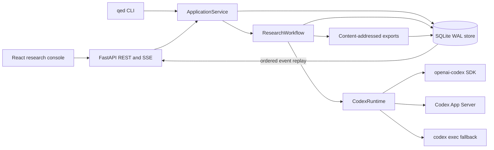
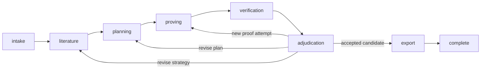

# Architecture

QED v2 alpha turns one frozen mathematical problem into a content-addressed
research record. SQLite owns state. Codex threads perform bounded work, and
application code decides whether a candidate earns a QED policy PASS.

## System map



The React client uses the versioned HTTP API and SSE stream. It never reads run
files or starts a process. FastAPI and the CLI call the same application
service. The workflow depends on the public store and runtime interfaces.
Local browser use connects to a tokenless loopback API. A remote browser uses an
external same-origin backend-for-frontend (BFF) with an HttpOnly session; the
BFF keeps the QED bearer token on its server-side hop.

## Run lifecycle



Each run also has a lifecycle status: `created`, `running`, `paused`,
`cancelling`, `cancelled`, `failed`, or `completed`. Stage changes and status
changes require store transactions. Store-assigned sequence numbers make the
event log replayable after a client disconnect.

Start and resume commands acquire execution leases with fencing tokens. A stale
worker cannot write after another execution claims the run. Cancel records the
request before the workflow interrupts active Codex turns. Resume appends an
execution segment and retains earlier attempts. Paused, cancelled, and failed
runs may resume from their current durable stage when no unconfirmed runtime
turn or live execution lease remains.

Operators inspect exceptional runs with `qed doctor RUN_ID`. QED lists
execution segments, external thread and turn identities, unresolved runtime
events, consumed budgets, and each condition that blocks resume. The locked
runtime abstraction cannot query one authoritative status by exact
backend/thread/turn identity across SDK, App Server, and exec. `qed reconcile`
reports that limit and creates no evidence. An operator can run `qed abandon
RUN_ID --reason ...` after a lease expires. The store writes an immutable
operator event and moves the run to non-resumable `failed`; it does not
synthesize a runtime terminal or grant PASS.

Each model call uses an immutable frozen turn input. QED records a turn-attempt
event before invoking the runtime; resume counts those events, so a process
restart cannot replenish the configured retry allowance. Local runtime
preflight runs before that marker. A normal stream end before any thread starts
records that the attempt did not start; any failure after remote acceptance may
be possible remains unresolved until reconciled.

A possibly accepted start retains execution ownership even before a turn ID is
known. Once known, normal completion, interruption, and failure all satisfy the
contract for that exact backend, thread, and turn. QED drains fenced lifecycle
events while cancelling, retains a reconciliation task when a terminal is late,
and drains those tasks before service shutdown closes the runtime or store. An
ambiguous start creates `runtime.turn_start_unconfirmed`; a known turn whose
stream ends early creates `runtime.turn_terminal_unconfirmed`. The store then
rejects cancellation acknowledgement, execution release, resume, and a
replacement execution even after lease expiry.

## Authority boundaries

| Concern | Owner | Contract |
| --- | --- | --- |
| Input and configuration | `qed.inputs`, `qed.config` | Strict frozen Pydantic models with canonical SHA-256 hashes |
| Declared state machines | `qed.state_machine` | Run, stage, and thread transition graphs |
| Schema migration | `qed.store_schema` | Supported database versions and fail-closed identity preflight |
| State and transitions | `qed.store` | SQLite transactions, immutable records, ordered events, execution fencing |
| Exceptional-run diagnosis | `qed.operations` | Read-only blocker and budget manifest; no runtime-state mutation |
| Codex transport | `qed.runtime` | One typed interface over SDK, App Server, and the selected exec fallback |
| Stage orchestration | `qed.workflow` | Bounded retries, cancel, resume, and role policy |
| Runtime-event support | `qed.workflow_support` | Search-event classification, observed-source records, and strict sibling cancellation |
| HTTP and SSE | `qed.api` | Versioned request and response models, replay from `Last-Event-ID` |
| CLI and process supervision | `qed.service`, `qed.cli` | The same commands and durable records as the HTTP surface |
| Export | `qed.export` | Deterministic `proof.md`, `report.md`, and `manifest.json` bundle |

Markdown has no control authority. Codex must return an output that matches the
JSON Schema for the role. The workflow validates the terminal JSON with the
matching Pydantic model before it writes a typed artifact or changes a stage.

## Thread and network policy

QED assigns separate Codex threads to literature, planning, proof generation,
verification, and adjudication. A proof candidate records its author thread and
plan. Sealing freezes its bytes and provenance.

Structural and detailed verifiers start on fresh threads, receive frozen input,
use a read-only sandbox, and run offline. Citation verification also starts on a
fresh read-only thread; it may use live web search under the restricted role
policy. Literature work may use the same search policy. The current workflow
has no command-network control. Every attempt receives a distinct server-owned
empty Git working directory, including retries. Request construction and local
preflight happen inside the attempt loop, and all runtime adapters disable
local shell, file-editing, browser, code-mode, plugin, and hook capabilities.

The store binds each verifier report to a nonempty external Codex thread
identity. It compares that identity with the candidate author's external
identity and with the other required verifiers. A database uniqueness
constraint rejects duplicate `(run_id, external_thread_id)` values. Migration
stops and names existing duplicates instead of overwriting them.

Fresh means that Codex created a new conversation state for the verifier. The
prover and verifier can still use the same model weights and share systematic
biases.

Stage gates are scoped to the current revision cycle. A proving-cycle entry
sets the lower event-sequence bound for eligible sealed candidates. Verification
and adjudication can use only reports and decisions linked to candidates after
that bound. Earlier candidates and reports stay immutable and visible for audit,
but they cannot satisfy a later cycle.

## QED policy PASS and export

The application requires structural and detailed reports for each candidate. A
run with evidence also requires a citation report with structured support for
every stored evidence record and no unknown evidence ID. Each support record
binds an exact span of the frozen proof to an exact excerpt of the frozen
evidence and its registered URI or ledger locator. A bare evidence ID or
free-text mention does not count. This proves that the citation check used the
registered bytes; the LLM still judges whether those bytes semantically support
the claim. Accepted reports must contain consistent checks and findings. QED
assigns stable IDs to frozen user
verification rules. Reports may cover a rule together, but at least one
structured PASS check must name each required rule ID. Unknown IDs, missing
coverage, FAIL, and UNCERTAIN all block PASS. Application code recomputes the
candidate decision from the frozen reports.

Export uses a durable `export_intent` boundary. The manifest records the run
status and stage observed at that event-chain boundary, normally
`running/export`, while separately recording the code verdict. Publishing the
content-addressed files is followed by artifact registration and the
`complete/completed` transition. A crash can leave an orphaned precommit bundle,
but that bundle does not claim that the terminal transition was observed.
`qed doctor` is the diagnostic manifest for non-success runs and includes every
immutable operator decision; ordinary PASS exports also project any operator
decision present in their selected event window.

QED policy PASS means that a sealed candidate met the configured code gates and
thread-isolated LLM checks. It does not certify peer review, formal or Lean
verification, or mathematical truth.

Completion requires a selected sealed candidate, its code decision, an
adjudication, and three registered export artifacts. QED writes each bundle to:

```text
<data-root>/exports/<run-id>/<bundle-sha256>/
├── proof.md
├── report.md
└── manifest.json
```

The manifest binds hashes for the input, configuration, evidence, plans,
candidates, verifier reports, adjudications, code decisions, frozen turn
inputs, thread provenance, proof-linked findings, and exported proof and report.
It records the status and stage observed at the event-chain boundary and keeps
the compatibility machine field `code_verdict: "PASS"`, whose reader-facing
meaning is QED policy PASS. A production export-intent bundle records
`running/export`; SQLite records the later terminal transition.
The manifest also records rule-to-report/check coverage, output-schema hashes,
turn/backend lineage, prompt versions,
canonical runtime resolutions, execution segments, detailed usage and timing,
and the first and last event sequences with a hash of the canonical event chain.
Usage includes input, output, cached-input, and reasoning-output tokens, turns,
search queries, and execution seconds. The bundle hash addresses the canonical
manifest. SHA-256 provides integrity addressing. It does not provide an author
signature, trusted timestamp, or source-authenticity proof.

## Runtime selection

`CodexRuntime` probes the exact model name and its advertised effort values. A
missing model or effort stops the run. `auto` selects `ultra` only when the run
requests proactive delegation, the runtime advertises multi-agent support, and
the model advertises `ultra`; otherwise it uses the model default. An explicit
effort must match the catalog and enables proactive delegation only when that
effort is `ultra` and the same capability checks pass.

The router uses the official Python SDK when it can represent every requested
control. In `auto` mode, it sends unsupported controls through the
version-matched App Server adapter. The `codex exec` backend runs only after a
caller selects it. Every backend emits the same internal event models.

The alpha configuration uses one global model name for all roles. A
role-specific model change needs a versioned config and migration contract,
per-turn actual-model recording, capability checks for each selected model, and
cross-role test coverage. The alpha does not ship a partial role override. See
[Role-specific model design](role-specific-models.md).

## Storage layout

```text
<data-root>/
├── qed.sqlite3
├── qed.sqlite3-shm             # present while SQLite uses shared memory
├── qed.sqlite3-wal             # present while SQLite has WAL content
├── exports/
│   └── <run-id>/<bundle-sha256>/
└── legacy-imports/
    └── legacy-<content-prefix>/
        ├── artifacts/
        └── manifest.json
```

The SQLite database remains the state authority. Export and legacy files serve
as immutable projections. See [Operations](operations.md) for backup and
recovery guidance and [Migration](migration.md) for legacy import semantics.
