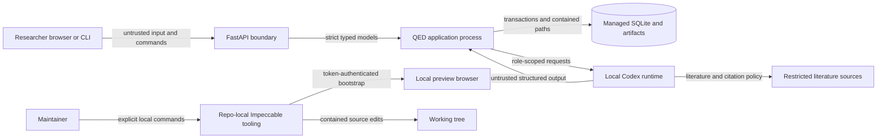

# Threat model

Review date: 2026-07-16

QED runs model-directed mathematical research and stores a trusted audit record.
The proof content remains untrusted until application checks and fresh verifier
threads satisfy the completion gate.

## Assets

- Codex authentication state and the QED bearer token
- local Impeccable live-session tokens and agent authentication state
- frozen problem, guidance, verification rules, and run configuration
- SQLite state, execution leases, events, and retry counters
- literature evidence and source metadata
- sealed proof candidates and verifier reports
- proof, report, manifest, and legacy import files

## Trust boundaries

The API treats browser and CLI input as untrusted. QED also treats Codex output,
web content, legacy files, Markdown, and a stale worker as untrusted.
An external backend-for-frontend (BFF) owns remote browser sessions and keeps
the QED bearer token outside JavaScript. Repo-local Impeccable commands also
treat checkout paths, filenames, symbolic links, browser messages, screenshots,
and generated edit instructions as untrusted input.

## Threats and controls

| Threat | Controls | Residual risk |
| --- | --- | --- |
| An unauthenticated user starts or controls research | Loopback bind by default; bearer token required for a non-loopback bind; exact CORS allowlist; REST mutations use validated IDs and idempotency keys | Bearer auth has no user identity, role, or per-run authorization. A deployment needs an external identity layer for separate trust groups. |
| A browser receives a secret | The console has no bearer-token input or storage; CI scans browser source for bearer headers and secret Vite variables; a remote BFF keeps the QED token server-side and gives the browser an HttpOnly session | A researcher can place a secret inside free-text problem or guidance. QED cannot classify every secret-shaped string. |
| Model text changes stage or grants PASS | Every control turn uses JSON Schema; Pydantic rejects malformed or extra fields; the store owns transitions; application code computes PASS from frozen reports | Structured models constrain shape, not mathematical truth. Independent review reduces risk without proving external correctness. |
| A proof author influences its verifier | Structural, detailed, and citation verification use fresh threads with frozen inputs and read-only sandboxes; structural and detailed checks run offline; the store rejects writer or verifier thread reuse | The same underlying model family may share training biases. QED records independence of conversation state, not independence of model weights. |
| A model modifies candidate bytes | Proof candidates seal before verification; SQLite triggers reject update and delete; reports bind candidate hashes; export recomputes hashes | Host compromise can modify the database and files together. Hashes detect accidental or partial change, not an attacker who can rewrite every record. |
| Search content injects instructions or exfiltrates data | Only literature and citation roles receive live web search; every attempt uses a distinct server-owned empty Git working directory and a read-only sandbox; the request model exposes no command network; SDK, App Server, and exec disable local shell, file, browser, code-mode, plugin, and hook capabilities; approval remains `never` | Search sources can serve hostile content. Operators must avoid secrets in model context. Host compromise remains outside the runtime sandbox boundary. |
| Personal Codex settings or ambient authentication weaken or redirect managed execution | QED defaults to the uv-pinned Codex binary; SDK, App Server, and exec share a persistent server-owned `CODEX_HOME` under the data root; strict configuration never reads personal `~/.codex/config.toml`; managed launches suppress inherited Codex access/API-key variables; the dedicated root is created with mode `0700` and receives no copied or linked personal credential | The dedicated root can contain Codex credentials and session state. The operator must restrict and encrypt the data root and its backups. A compromised service account remains outside this boundary. |
| A stale or duplicate worker corrupts state | Execution leases, fencing tokens, store transactions, run capacity limits, and monotonic event sequences reject stale writes and duplicate active work | SQLite targets one host and one managed filesystem. QED does not claim a distributed-worker design. |
| Cancel or crash loses provenance | QED runs local preflight before recording each attempt and records cancellation before interrupt; ambiguous starts and known turns retain ownership until proven not started or matched by a terminal; fenced lifecycle events drain while cancelling, reconciliation pumps retain late terminals, and service shutdown drains those pumps before closing state | A missing terminal or ambiguous start deliberately leaves the run unavailable for normal resume and needs incident investigation after reconciliation is lost. Host loss before durable storage completes can lose the current uncommitted transaction. |
| A path escapes the managed root | Run IDs and artifact paths use closed patterns; export rejects symbolic-link components and writes by staging rename; legacy inventory and copy walk from one pinned source-directory descriptor with no-follow opens for every segment; runtime attempts use private temporary working directories | An operator with host access can replace the managed root while the process is down. Filesystem permissions remain an operator duty. |
| Local Impeccable tooling follows a hostile checkout path or executes checkout text | Linux descriptor-pinned filesystem helpers restrict reads, writes, removals, and local Git exclude updates to regular entries under an opened repository directory, including across parent swaps; Git metadata updates reject `.git` links and pointer files; child processes receive fixed argv without a shell; model-facing checkout text stays dynamically delimited and context budgets remove whole untrusted records or use a data-free fallback rather than slicing; the edit agent uses a workspace-write sandbox with approvals disabled; package-defined validation stays disabled unless the maintainer opts in | Impeccable can modify repository files by design. A same-account process with checkout write access can rewrite a Svelte session manifest and redirect Accept to another in-repository `.svelte` file, but it already has authority to edit that file directly. The helpers fail closed without Linux `/proc/self/fd`; they do not isolate mutually hostile tools under one account. Maintainers must review generated edits. |
| Another local page connects to the Impeccable live server or reads screenshot bytes | An agent-only UUID authorizes one exact preview origin; a fixed-URL, exact-CORS bootstrap issues a separate browser capability only in the injected closure; later browser routes require that capability plus the exact origin. Source reads are limited to agent-issued active-session files, and screenshot paths must have been issued for the same event. | The overlay and application JavaScript share one page realm, so lexical scope is not an extension-style isolation boundary against code that tampers with browser primitives before bootstrap. Use live mode only with preview code trusted to run in that page. Same-account processes can inspect process state or repository files and remain outside this boundary. |
| A legacy PASS gains current authority | Migration labels every import `legacy_untrusted`, copies regular files by hash, and creates no current run decision | Researchers can still misread historical Markdown. The UI and docs must keep the trust label visible. |
| Dependency or action supply-chain compromise | uv and npm lockfiles freeze application dependencies; CI pins third-party actions to commit SHA values; real Codex tests stay outside default CI | The Python build backend constraint permits compatible Hatchling releases, and Codex remains an external runtime dependency. Release review must inspect lock and action updates. |
| Export hashes imply an author signature | The manifest binds terminal `completed` status, explicit code-derived `PASS`, typed research records, frozen turn inputs and output schemas, thread/turn provenance, findings, runtime resolutions, execution segments, token usage, timing, the canonical event chain, and proof and report files | SHA-256 gives integrity addressing, not signing, timestamp authority, or author identity. |

## Deployment assumptions

QED assumes:

- the host, service account, dedicated Codex authentication context, and
  data-root parent directory belong to the operator;
- the reverse proxy terminates TLS for remote access and does not expose files;
- the data root uses a local filesystem with SQLite lock and durability support;
- researchers understand that a code-computed PASS records the configured QED
  verification policy rather than peer review or a formal proof-assistant check.

## Forbidden configurations

QED does not support:

- a public bind without bearer authentication and TLS termination;
- wildcard CORS origins;
- full-access sandboxes or approval bypass flags;
- raw Codex configuration from an API client;
- writable or resumed verifier threads;
- search or command network for planning, proof, adjudication, structural
  verification, or detailed verification;
- shared browser-visible API credentials;
- direct remote browser access to the bearer-protected QED API without an
  external HttpOnly session layer;
- direct public access to Codex App Server, SQLite, exports, or legacy imports;
- Impeccable reads or writes through symbolic links or paths outside the active
  checkout;
- an anonymous Impeccable live bootstrap or a browser-global live token;
- automatic execution of project-defined validation scripts during live edits.

## Release review

Review this threat model when a change adds an API route, credential source,
runtime control, network domain, sandbox mode, artifact type, schema migration,
deployment topology, or local developer-tool boundary. Run the security,
Impeccable regression, and mutation-verifier tests before release. Record current
Codex facts and source links in `docs/research/`.
